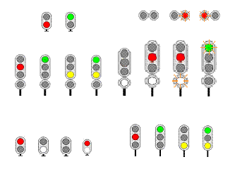
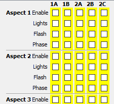
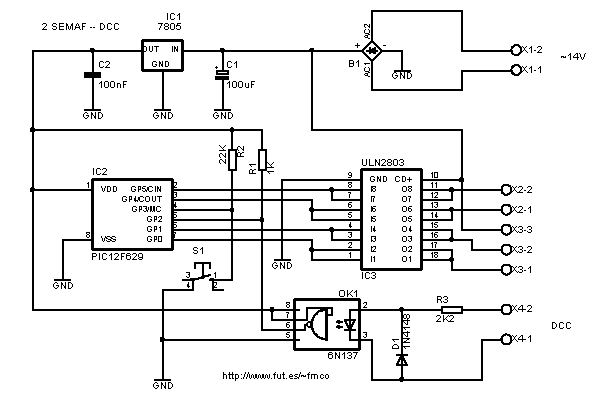
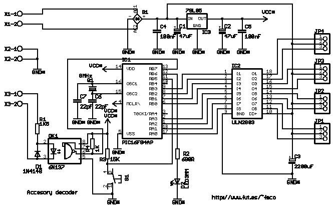
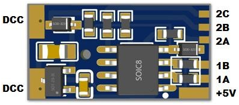
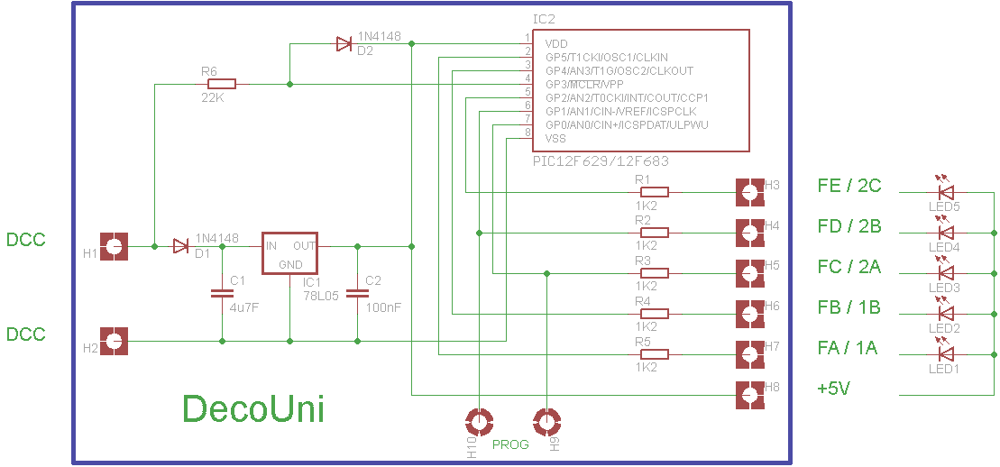

# UniSemaf
UniSemaf is a series of DCC accessory decoders based on PIC to manage multiaspect signals.

Depending the version used you can control up to 4, 5 or 8 lights with a maximun of 8 or 32 aspects with fade on/off effect for the lights.

You can select the maximum intensity for each light, as well as the on/off speed and flashing frequency.

You can freely choose the lights used, the aspects they display, and whether they are steady or flashing.

 

Every aspect is defined by four CV:
- The first one enables the output for this aspect, so you can have more than one semaphore in the decoder if there are free outputs.
- The second one selects the light output goes on or off.
- The third one selects if the light output must flash or not.
- The last one select the phase of the flashing.

 

 ## UniSemaf (PIC12F629)

Semaphore decoder, with 4 outputs and 8 aspects using the PIC12F629.

 

 ## UniSemaf648 (PIC16F628 / PIC16F648A)

Semaphore decoder, with 8 outputs and 32 aspects using the IC16F648A or 24 aspects using the PIC16F628.

 

 ## UniSemaf (PIC12F629 / PIC12F683)

Semaphore decoder, with 5 outputs and 8 aspects using the PIC12F629 or the PIC12F683 with predefined types of semaphores. It drives directly the LED and includes the limiting resistor in the PCB.

 

 

